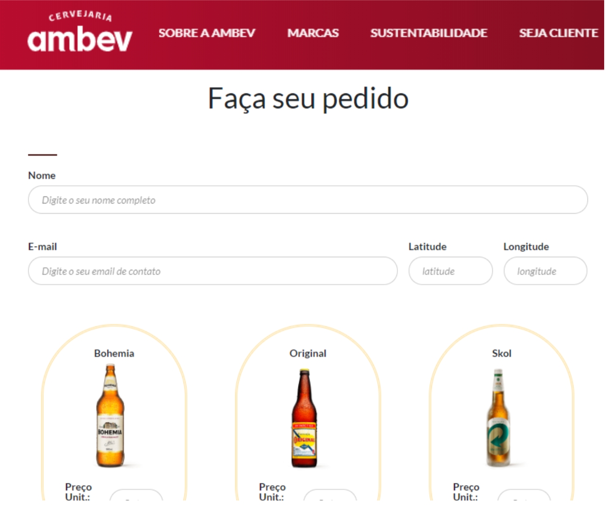

# Brasa Hacks | MARCH 2020

Hackaton Project:
* Desafio Ambev: Last Mile Delivery

The project is an Web Applocation developed using Flask framework.

The front page looks as follows:


## Installation

The code should run with no issues using Python versions 3.*

Use [pip](https://pip.pypa.io/en/stable/) oacket manager in order to install all python dependencies from the file:  *requirements.txt*

```bash
pip install -r requirements.txt
```

## Usage

The application requieres a database in order to run. The *.env* file was removed from the repository for security reasons.
To run the application, run the following command:

```bash
python wsgi.py
```
Acess the following *url*:

```bash
http://127.0.0.1:5000/pedido
```

## Authors
Contributers: Bruno Hassan, Daniel da Costa, Felipe Pater, Icaro Torres e Marcelo Hiltner
